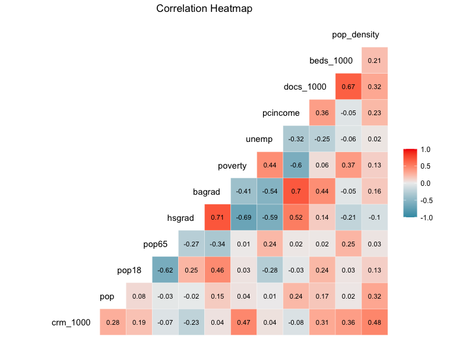

P8130 Final Project
================

### Abstract

### Introduction (brief context and background of the problem)

### Methods (data description and statistical methods)

### Results

### Conclusions/Discussion

``` r
# import necessary datasets
library(tidyverse)
library(ggplot2)
library(GGally)
library(PerformanceAnalytics)
library(performance)
library(MASS)
library(leaps)
library(modelr)
library(olsrr)
```

## Read in dataset

``` r
cdi = read_csv("./cdi.csv") %>% 
  janitor::clean_names()
```

``` r
## no missing value
cdi %>% 
  dplyr::select(everything()) %>%  
  summarise_all(funs(sum(is.na(.)))) %>% 
  knitr::kable()
```

|  id | cty | state | area | pop | pop18 | pop65 | docs | beds | crimes | hsgrad | bagrad | poverty | unemp | pcincome | totalinc | region |
|----:|----:|------:|-----:|----:|------:|------:|-----:|-----:|-------:|-------:|-------:|--------:|------:|---------:|---------:|-------:|
|   0 |   0 |     0 |    0 |   0 |     0 |     0 |    0 |    0 |      0 |      0 |      0 |       0 |     0 |        0 |        0 |      0 |

## Data cleaning

First, some normalization for better comparison

``` r
cdi = 
  cdi %>% 
  mutate(crm_1000 = crimes/pop*1000,  # as indicated by the project prompt
         docs_1000 = docs/pop*1000,  # every 1000 people how many doctors
         beds_1000 = beds/pop*1000, # similar as above
         pop_density = pop/area,  # how many people per square miles
         northeast = ifelse(region == 1, 1, 0),  # region as dummy varaible
         northcentral = ifelse(region == 2, 1, 0),
         south = ifelse(region == 3, 1, 0)) %>% 
  dplyr::select(-id, -crimes,-area, -docs, -beds, -totalinc, -region)
```

## Data Exploration

``` r
## summary statistics, tentative, NOT FINAL
sum_cdi = 
  cdi %>% 
  dplyr::select(-c(cty, state))
summary(sum_cdi)
```

    ##       pop              pop18           pop65            hsgrad     
    ##  Min.   : 100043   Min.   :16.40   Min.   : 3.000   Min.   :46.60  
    ##  1st Qu.: 139027   1st Qu.:26.20   1st Qu.: 9.875   1st Qu.:73.88  
    ##  Median : 217280   Median :28.10   Median :11.750   Median :77.70  
    ##  Mean   : 393011   Mean   :28.57   Mean   :12.170   Mean   :77.56  
    ##  3rd Qu.: 436064   3rd Qu.:30.02   3rd Qu.:13.625   3rd Qu.:82.40  
    ##  Max.   :8863164   Max.   :49.70   Max.   :33.800   Max.   :92.90  
    ##      bagrad         poverty           unemp           pcincome    
    ##  Min.   : 8.10   Min.   : 1.400   Min.   : 2.200   Min.   : 8899  
    ##  1st Qu.:15.28   1st Qu.: 5.300   1st Qu.: 5.100   1st Qu.:16118  
    ##  Median :19.70   Median : 7.900   Median : 6.200   Median :17759  
    ##  Mean   :21.08   Mean   : 8.721   Mean   : 6.597   Mean   :18561  
    ##  3rd Qu.:25.32   3rd Qu.:10.900   3rd Qu.: 7.500   3rd Qu.:20270  
    ##  Max.   :52.30   Max.   :36.300   Max.   :21.300   Max.   :37541  
    ##     crm_1000         docs_1000         beds_1000        pop_density      
    ##  Min.   :  4.601   Min.   : 0.3559   Min.   : 0.1649   Min.   :   13.26  
    ##  1st Qu.: 38.102   1st Qu.: 1.2127   1st Qu.: 2.1972   1st Qu.:  192.34  
    ##  Median : 52.429   Median : 1.7509   Median : 3.3287   Median :  335.91  
    ##  Mean   : 57.286   Mean   : 2.1230   Mean   : 3.6493   Mean   :  888.44  
    ##  3rd Qu.: 72.597   3rd Qu.: 2.4915   3rd Qu.: 4.5649   3rd Qu.:  756.55  
    ##  Max.   :295.987   Max.   :17.0377   Max.   :19.6982   Max.   :32403.72  
    ##    northeast       northcentral        south       
    ##  Min.   :0.0000   Min.   :0.0000   Min.   :0.0000  
    ##  1st Qu.:0.0000   1st Qu.:0.0000   1st Qu.:0.0000  
    ##  Median :0.0000   Median :0.0000   Median :0.0000  
    ##  Mean   :0.2341   Mean   :0.2455   Mean   :0.3455  
    ##  3rd Qu.:0.0000   3rd Qu.:0.0000   3rd Qu.:1.0000  
    ##  Max.   :1.0000   Max.   :1.0000   Max.   :1.0000

``` r
mean_crm = mean(sum_cdi$crm_1000)
cdi_state = cdi %>% 
  group_by(state) %>% 
  summarize(crime_rate = mean(crm_1000)) %>% 
  mutate(low_high = ifelse(crime_rate>mean_crm, TRUE,FALSE))
  

cdi_state %>% 
  mutate(state = fct_reorder(state, crime_rate)) %>% 
  ggplot(aes(x = state, y = crime_rate))+
  geom_hline(yintercept = mean_crm, color = "red")+
  geom_point(aes(color = low_high),size = 3)+
  ggtitle("Crime Rates in the US States") +
  labs(y = "Crime Rate Per 1000", x = "States") +
  theme(plot.title = element_text(hjust = 0.5),
        axis.text.x = element_text(angle = 90, vjust = 0.5, hjust= 1),
        legend.position = "none")
```


### boxplot for each variable

``` r
par(mfrow=c(2,3))
boxplot(sum_cdi$crm_1000, main='Crime Rate')
boxplot(sum_cdi$docs_1000, main='Doctor Density')
boxplot(sum_cdi$pop_density,main='Population Density' )
boxplot(sum_cdi$hsgrad, main='High School Graduate')
boxplot(sum_cdi$bagrad, main='Bachelor Graduate')
boxplot(sum_cdi$poverty, main='Poverty')
```


``` r
par(mfrow=c(2,3))
boxplot(sum_cdi$unemp, main='Unemployment Rate')
boxplot(sum_cdi$pcincome, main='Per capita Income')
boxplot(sum_cdi$beds_1000, main='Beds Rate')
boxplot(sum_cdi$pop, main='Population')
boxplot(sum_cdi$pop18, main='PP aged 18-34')
boxplot(sum_cdi$pop65, main='PP aged 65+')
```


### Histogram for each variable

``` r
par(mfrow=c(2,3))
hist(sum_cdi$crm_1000, main='Crime Rate')
hist(sum_cdi$docs_1000, main='Doctor Density')
hist(sum_cdi$pop_density,main='Population Density' )
hist(sum_cdi$hsgrad, main='High School Graduate')
hist(sum_cdi$bagrad, main='Bachelor Graduate')
hist(sum_cdi$poverty, main='Poverty')
```


``` r
par(mfrow=c(2,3))
hist(sum_cdi$unemp, main='Unemployment Rate')
hist(sum_cdi$pcincome, main='Per capita Income')
hist(sum_cdi$beds_1000, main='Beds Rate')
hist(sum_cdi$pop, main='Population')
hist(sum_cdi$pop18, main='PP aged 18-34')
hist(sum_cdi$pop65, main='PP aged 65+')
```


### Marginal Correlation and Correlation martix

``` r
corr_matrix = 
  cdi %>% 
  dplyr::select(-state, -cty, -northeast, -northcentral, -south) %>% 
  chart.Correlation(histogram = TRUE, method = "pearson")
```


### Correlation Heatmap

``` r
cdi %>% 
  dplyr::select(-state, -cty, -northeast, -northcentral, -south) %>% 
  dplyr::select(crm_1000, everything()) %>% 
  ggcorr(label=TRUE, hjust = 0.9, layout.exp = 2, label_size = 3, label_round = 2)
```



## Build Model

### Full Model

Let’s start with the full model

``` r
mult_fit = lm(crm_1000 ~ ., data = sum_cdi)
summary(mult_fit)
```

    ## 
    ## Call:
    ## lm(formula = crm_1000 ~ ., data = sum_cdi)
    ## 
    ## Residuals:
    ##     Min      1Q  Median      3Q     Max 
    ## -47.786 -11.422  -0.934  10.200  75.180 
    ## 
    ## Coefficients:
    ##                Estimate Std. Error t value Pr(>|t|)    
    ## (Intercept)  -4.805e+01  2.770e+01  -1.734 0.083592 .  
    ## pop           5.486e-06  1.579e-06   3.474 0.000566 ***
    ## pop18         6.947e-01  3.305e-01   2.102 0.036150 *  
    ## pop65        -1.998e-01  3.055e-01  -0.654 0.513410    
    ## hsgrad        6.143e-01  2.690e-01   2.284 0.022864 *  
    ## bagrad       -4.835e-01  2.971e-01  -1.628 0.104327    
    ## poverty       1.856e+00  3.864e-01   4.803 2.17e-06 ***
    ## unemp         6.111e-01  5.314e-01   1.150 0.250812    
    ## pcincome      1.039e-03  4.734e-04   2.195 0.028670 *  
    ## docs_1000    -6.634e-01  1.019e+00  -0.651 0.515556    
    ## beds_1000     3.157e+00  7.939e-01   3.977 8.21e-05 ***
    ## pop_density   4.901e-03  4.537e-04  10.802  < 2e-16 ***
    ## northeast    -2.118e+01  3.125e+00  -6.778 4.09e-11 ***
    ## northcentral -1.220e+01  2.984e+00  -4.089 5.18e-05 ***
    ## south         6.614e+00  2.863e+00   2.310 0.021353 *  
    ## ---
    ## Signif. codes:  0 '***' 0.001 '**' 0.01 '*' 0.05 '.' 0.1 ' ' 1
    ## 
    ## Residual standard error: 17.81 on 425 degrees of freedom
    ## Multiple R-squared:  0.589,  Adjusted R-squared:  0.5755 
    ## F-statistic: 43.51 on 14 and 425 DF,  p-value: < 2.2e-16

Model diagnostics of the full model

``` r
par(mfrow=c(2,2))
plot(mult_fit)
```


``` r
# get the lambda for the transformation
bc_model = boxcox(mult_fit, lambda = seq(-3, 3, by = 0.25))
```


``` r
lamb = bc_model$x[which.max(bc_model$y)]
lamb
```

    ## [1] 0.5757576

\~0.5, thus we applied square root to the Y. Also we get rid of the
influential points. The full model is the basis of other models, thus we
choose to filter the outliers out at first.

``` r
sum_cdi_mod = sum_cdi[-c(1,6),]  # filter out outlier and store it as the new dataset
full_trans_fit = lm(sqrt(crm_1000) ~.,data = sum_cdi_mod)  # refit
```

``` r
# check again
par(mfrow=c(2,2))
plot(full_trans_fit)
```


``` r
summary(full_trans_fit)
```

    ## 
    ## Call:
    ## lm(formula = sqrt(crm_1000) ~ ., data = sum_cdi_mod)
    ## 
    ## Residuals:
    ##     Min      1Q  Median      3Q     Max 
    ## -4.0654 -0.6625  0.0540  0.7183  3.9085 
    ## 
    ## Coefficients:
    ##                Estimate Std. Error t value Pr(>|t|)    
    ## (Intercept)   7.644e-02  1.786e+00   0.043 0.965879    
    ## pop           7.281e-07  1.425e-07   5.111 4.87e-07 ***
    ## pop18         7.584e-02  2.159e-02   3.513 0.000491 ***
    ## pop65        -2.316e-04  1.965e-02  -0.012 0.990601    
    ## hsgrad        2.583e-02  1.733e-02   1.491 0.136820    
    ## bagrad       -3.462e-02  1.911e-02  -1.812 0.070658 .  
    ## poverty       1.111e-01  2.492e-02   4.457 1.07e-05 ***
    ## unemp         4.736e-02  3.407e-02   1.390 0.165214    
    ## pcincome      1.058e-04  3.141e-05   3.367 0.000828 ***
    ## docs_1000    -2.102e-02  6.581e-02  -0.319 0.749576    
    ## beds_1000     2.286e-01  5.101e-02   4.481 9.59e-06 ***
    ## pop_density   8.083e-05  4.359e-05   1.854 0.064417 .  
    ## northeast    -1.719e+00  2.008e-01  -8.565  < 2e-16 ***
    ## northcentral -9.851e-01  1.912e-01  -5.151 3.97e-07 ***
    ## south         3.042e-01  1.835e-01   1.658 0.098155 .  
    ## ---
    ## Signif. codes:  0 '***' 0.001 '**' 0.01 '*' 0.05 '.' 0.1 ' ' 1
    ## 
    ## Residual standard error: 1.141 on 423 degrees of freedom
    ## Multiple R-squared:  0.551,  Adjusted R-squared:  0.5361 
    ## F-statistic: 37.08 on 14 and 423 DF,  p-value: < 2.2e-16

``` r
check_collinearity(full_trans_fit)
```

    ## # Check for Multicollinearity
    ## 
    ## Low Correlation
    ## 
    ##          Term  VIF Increased SE Tolerance
    ##           pop 1.00         1.00      1.00
    ##         pop18 2.65         1.63      0.38
    ##         pop65 2.07         1.44      0.48
    ##        hsgrad 3.28         1.81      0.31
    ##        bagrad 3.74         1.93      0.27
    ##       poverty 2.43         1.56      0.41
    ##         unemp 1.89         1.37      0.53
    ##      pcincome 1.02         1.01      0.98
    ##     docs_1000 2.62         1.62      0.38
    ##     beds_1000 3.16         1.78      0.32
    ##   pop_density 1.01         1.01      0.99
    ##     northeast 2.21         1.49      0.45
    ##  northcentral 2.28         1.51      0.44
    ##         south 2.46         1.57      0.41

We will just use the transformed models for the further model fits

### Backward Elimination

``` r
multi_back = step(full_trans_fit, direction='backward')
```

    ## Start:  AIC=130.27
    ## sqrt(crm_1000) ~ pop + pop18 + pop65 + hsgrad + bagrad + poverty + 
    ##     unemp + pcincome + docs_1000 + beds_1000 + pop_density + 
    ##     northeast + northcentral + south
    ## 
    ##                Df Sum of Sq    RSS    AIC
    ## - pop65         1     0.000 550.67 128.27
    ## - docs_1000     1     0.133 550.81 128.37
    ## - unemp         1     2.516 553.19 130.26
    ## <none>                      550.67 130.27
    ## - hsgrad        1     2.892 553.56 130.56
    ## - south         1     3.577 554.25 131.10
    ## - bagrad        1     4.275 554.95 131.66
    ## - pop_density   1     4.475 555.15 131.81
    ## - pcincome      1    14.762 565.43 139.85
    ## - pop18         1    16.064 566.74 140.86
    ## - poverty       1    25.858 576.53 148.37
    ## - beds_1000     1    26.137 576.81 148.58
    ## - pop           1    34.004 584.68 154.51
    ## - northcentral  1    34.547 585.22 154.92
    ## - northeast     1    95.493 646.17 198.31
    ## 
    ## Step:  AIC=128.27
    ## sqrt(crm_1000) ~ pop + pop18 + hsgrad + bagrad + poverty + unemp + 
    ##     pcincome + docs_1000 + beds_1000 + pop_density + northeast + 
    ##     northcentral + south
    ## 
    ##                Df Sum of Sq    RSS    AIC
    ## - docs_1000     1     0.133 550.81 126.37
    ## <none>                      550.67 128.27
    ## - unemp         1     2.550 553.22 128.29
    ## - hsgrad        1     2.903 553.58 128.57
    ## - south         1     3.583 554.26 129.11
    ## - bagrad        1     4.277 554.95 129.66
    ## - pop_density   1     4.515 555.19 129.84
    ## - pcincome      1    14.879 565.55 137.94
    ## - pop18         1    21.617 572.29 143.13
    ## - poverty       1    27.010 577.68 147.24
    ## - beds_1000     1    28.382 579.05 148.28
    ## - pop           1    34.067 584.74 152.56
    ## - northcentral  1    34.747 585.42 153.07
    ## - northeast     1    96.401 647.07 196.93
    ## 
    ## Step:  AIC=126.37
    ## sqrt(crm_1000) ~ pop + pop18 + hsgrad + bagrad + poverty + unemp + 
    ##     pcincome + beds_1000 + pop_density + northeast + northcentral + 
    ##     south
    ## 
    ##                Df Sum of Sq    RSS    AIC
    ## <none>                      550.81 126.37
    ## - unemp         1     2.533 553.34 126.38
    ## - hsgrad        1     3.010 553.82 126.76
    ## - south         1     3.944 554.75 127.50
    ## - pop_density   1     4.387 555.19 127.85
    ## - bagrad        1     4.988 555.79 128.32
    ## - pcincome      1    14.747 565.55 135.94
    ## - pop18         1    21.486 572.29 141.13
    ## - poverty       1    27.234 578.04 145.51
    ## - pop           1    33.948 584.75 150.57
    ## - northcentral  1    35.244 586.05 151.54
    ## - beds_1000     1    52.476 603.28 164.23
    ## - northeast     1    97.351 648.16 195.66

``` r
multi_back
```

    ## 
    ## Call:
    ## lm(formula = sqrt(crm_1000) ~ pop + pop18 + hsgrad + bagrad + 
    ##     poverty + unemp + pcincome + beds_1000 + pop_density + northeast + 
    ##     northcentral + south, data = sum_cdi_mod)
    ## 
    ## Coefficients:
    ##  (Intercept)           pop         pop18        hsgrad        bagrad  
    ##    9.096e-02     7.261e-07     7.546e-02     2.624e-02    -3.617e-02  
    ##      poverty         unemp      pcincome     beds_1000   pop_density  
    ##    1.115e-01     4.714e-02     1.048e-04     2.172e-01     7.880e-05  
    ##    northeast  northcentral         south  
    ##   -1.711e+00    -9.731e-01     3.142e-01

sqrt(crm_1000) \~ pop + pop18 + hsgrad + bagrad + poverty + unemp+
pcincome + beds_1000 + pop_density + northeast + northcentral + south,
data = sum_cdi_mod

Model Diagnostic

``` r
par(mfrow = c(2,2))
plot(multi_back)
```


``` r
check_collinearity(multi_back)
```

    ## # Check for Multicollinearity
    ## 
    ## Low Correlation
    ## 
    ##          Term  VIF Increased SE Tolerance
    ##           pop 1.00         1.00      1.00
    ##         pop18 1.96         1.40      0.51
    ##        hsgrad 3.25         1.80      0.31
    ##        bagrad 3.50         1.87      0.29
    ##       poverty 2.33         1.53      0.43
    ##         unemp 1.86         1.36      0.54
    ##      pcincome 1.03         1.01      0.97
    ##     beds_1000 1.42         1.19      0.70
    ##   pop_density 1.01         1.01      0.99
    ##     northeast 2.15         1.47      0.47
    ##  northcentral 2.18         1.48      0.46
    ##         south 2.38         1.54      0.42

### Forward Selection

``` r
multi_forward = step(full_trans_fit, direction = 'forward')
```

    ## Start:  AIC=130.27
    ## sqrt(crm_1000) ~ pop + pop18 + pop65 + hsgrad + bagrad + poverty + 
    ##     unemp + pcincome + docs_1000 + beds_1000 + pop_density + 
    ##     northeast + northcentral + south

``` r
multi_forward
```

    ## 
    ## Call:
    ## lm(formula = sqrt(crm_1000) ~ pop + pop18 + pop65 + hsgrad + 
    ##     bagrad + poverty + unemp + pcincome + docs_1000 + beds_1000 + 
    ##     pop_density + northeast + northcentral + south, data = sum_cdi_mod)
    ## 
    ## Coefficients:
    ##  (Intercept)           pop         pop18         pop65        hsgrad  
    ##    7.644e-02     7.281e-07     7.584e-02    -2.316e-04     2.583e-02  
    ##       bagrad       poverty         unemp      pcincome     docs_1000  
    ##   -3.462e-02     1.111e-01     4.736e-02     1.058e-04    -2.102e-02  
    ##    beds_1000   pop_density     northeast  northcentral         south  
    ##    2.286e-01     8.083e-05    -1.719e+00    -9.851e-01     3.042e-01

sqrt(crm_1000) \~ pop + pop18 + pop65 + hsgrad + bagrad + poverty +
unemp + pcincome + docs_1000 + beds_1000 + pop_density + northeast +
northcentral + south, data = sum_cdi_mod

Forward selection generated the same result as the full model, thus we
will not consider it from now on.

### Both direction

``` r
multi_both = step(full_trans_fit, direction = "both")
```

    ## Start:  AIC=130.27
    ## sqrt(crm_1000) ~ pop + pop18 + pop65 + hsgrad + bagrad + poverty + 
    ##     unemp + pcincome + docs_1000 + beds_1000 + pop_density + 
    ##     northeast + northcentral + south
    ## 
    ##                Df Sum of Sq    RSS    AIC
    ## - pop65         1     0.000 550.67 128.27
    ## - docs_1000     1     0.133 550.81 128.37
    ## - unemp         1     2.516 553.19 130.26
    ## <none>                      550.67 130.27
    ## - hsgrad        1     2.892 553.56 130.56
    ## - south         1     3.577 554.25 131.10
    ## - bagrad        1     4.275 554.95 131.66
    ## - pop_density   1     4.475 555.15 131.81
    ## - pcincome      1    14.762 565.43 139.85
    ## - pop18         1    16.064 566.74 140.86
    ## - poverty       1    25.858 576.53 148.37
    ## - beds_1000     1    26.137 576.81 148.58
    ## - pop           1    34.004 584.68 154.51
    ## - northcentral  1    34.547 585.22 154.92
    ## - northeast     1    95.493 646.17 198.31
    ## 
    ## Step:  AIC=128.27
    ## sqrt(crm_1000) ~ pop + pop18 + hsgrad + bagrad + poverty + unemp + 
    ##     pcincome + docs_1000 + beds_1000 + pop_density + northeast + 
    ##     northcentral + south
    ## 
    ##                Df Sum of Sq    RSS    AIC
    ## - docs_1000     1     0.133 550.81 126.37
    ## <none>                      550.67 128.27
    ## - unemp         1     2.550 553.22 128.29
    ## - hsgrad        1     2.903 553.58 128.57
    ## - south         1     3.583 554.26 129.11
    ## - bagrad        1     4.277 554.95 129.66
    ## - pop_density   1     4.515 555.19 129.84
    ## + pop65         1     0.000 550.67 130.27
    ## - pcincome      1    14.879 565.55 137.94
    ## - pop18         1    21.617 572.29 143.13
    ## - poverty       1    27.010 577.68 147.24
    ## - beds_1000     1    28.382 579.05 148.28
    ## - pop           1    34.067 584.74 152.56
    ## - northcentral  1    34.747 585.42 153.07
    ## - northeast     1    96.401 647.07 196.93
    ## 
    ## Step:  AIC=126.37
    ## sqrt(crm_1000) ~ pop + pop18 + hsgrad + bagrad + poverty + unemp + 
    ##     pcincome + beds_1000 + pop_density + northeast + northcentral + 
    ##     south
    ## 
    ##                Df Sum of Sq    RSS    AIC
    ## <none>                      550.81 126.37
    ## - unemp         1     2.533 553.34 126.38
    ## - hsgrad        1     3.010 553.82 126.76
    ## - south         1     3.944 554.75 127.50
    ## - pop_density   1     4.387 555.19 127.85
    ## + docs_1000     1     0.133 550.67 128.27
    ## - bagrad        1     4.988 555.79 128.32
    ## + pop65         1     0.000 550.81 128.37
    ## - pcincome      1    14.747 565.55 135.94
    ## - pop18         1    21.486 572.29 141.13
    ## - poverty       1    27.234 578.04 145.51
    ## - pop           1    33.948 584.75 150.57
    ## - northcentral  1    35.244 586.05 151.54
    ## - beds_1000     1    52.476 603.28 164.23
    ## - northeast     1    97.351 648.16 195.66

``` r
multi_both
```

    ## 
    ## Call:
    ## lm(formula = sqrt(crm_1000) ~ pop + pop18 + hsgrad + bagrad + 
    ##     poverty + unemp + pcincome + beds_1000 + pop_density + northeast + 
    ##     northcentral + south, data = sum_cdi_mod)
    ## 
    ## Coefficients:
    ##  (Intercept)           pop         pop18        hsgrad        bagrad  
    ##    9.096e-02     7.261e-07     7.546e-02     2.624e-02    -3.617e-02  
    ##      poverty         unemp      pcincome     beds_1000   pop_density  
    ##    1.115e-01     4.714e-02     1.048e-04     2.172e-01     7.880e-05  
    ##    northeast  northcentral         south  
    ##   -1.711e+00    -9.731e-01     3.142e-01

sqrt(crm_1000) \~ pop + pop18 + hsgrad + bagrad + poverty + unemp +
pcincome + beds_1000 + pop_density + northeast + northcentral + south,
data = sum_cdi_mod

the same model as the backward selection, we will not focus on this
model from now on

### Interaction Model

Choose backward selection-generated model as the basis since it’s with
the highest adjusted r-squared. The choice of interaction is somewhat
arbitrary, mainly based on the correlation heatmap and also to avoid
high collinearity. After a few tries, we added two more interaction
terms as the following

``` r
multi_interact = lm(sqrt(crm_1000) ~ pop + pop18 + hsgrad + bagrad + poverty + unemp+ pcincome + beds_1000 
                    + pop_density + northeast + northcentral + south + pop*bagrad, data = sum_cdi_mod)
summary(multi_interact)
```

    ## 
    ## Call:
    ## lm(formula = sqrt(crm_1000) ~ pop + pop18 + hsgrad + bagrad + 
    ##     poverty + unemp + pcincome + beds_1000 + pop_density + northeast + 
    ##     northcentral + south + pop * bagrad, data = sum_cdi_mod)
    ## 
    ## Residuals:
    ##     Min      1Q  Median      3Q     Max 
    ## -3.9985 -0.6575  0.0414  0.6784  3.8847 
    ## 
    ## Coefficients:
    ##                Estimate Std. Error t value Pr(>|t|)    
    ## (Intercept)  -1.807e-01  1.657e+00  -0.109 0.913202    
    ## pop           2.249e-06  5.585e-07   4.027 6.70e-05 ***
    ## pop18         7.328e-02  1.840e-02   3.983 8.01e-05 ***
    ## hsgrad        2.358e-02  1.711e-02   1.378 0.168909    
    ## bagrad       -1.581e-02  1.967e-02  -0.804 0.421894    
    ## poverty       1.120e-01  2.413e-02   4.641 4.63e-06 ***
    ## unemp         4.273e-02  3.349e-02   1.276 0.202656    
    ## pcincome      1.143e-04  3.101e-05   3.686 0.000257 ***
    ## beds_1000     2.085e-01  3.401e-02   6.132 1.99e-09 ***
    ## pop_density   7.027e-05  4.260e-05   1.650 0.099780 .  
    ## northeast    -1.725e+00  1.958e-01  -8.809  < 2e-16 ***
    ## northcentral -9.747e-01  1.851e-01  -5.266 2.22e-07 ***
    ## south         3.146e-01  1.787e-01   1.761 0.079001 .  
    ## pop:bagrad   -6.611e-08  2.346e-08  -2.818 0.005064 ** 
    ## ---
    ## Signif. codes:  0 '***' 0.001 '**' 0.01 '*' 0.05 '.' 0.1 ' ' 1
    ## 
    ## Residual standard error: 1.129 on 424 degrees of freedom
    ## Multiple R-squared:  0.5592, Adjusted R-squared:  0.5456 
    ## F-statistic: 41.37 on 13 and 424 DF,  p-value: < 2.2e-16

``` r
anova(multi_back, multi_interact)
```

    ## Analysis of Variance Table
    ## 
    ## Model 1: sqrt(crm_1000) ~ pop + pop18 + hsgrad + bagrad + poverty + unemp + 
    ##     pcincome + beds_1000 + pop_density + northeast + northcentral + 
    ##     south
    ## Model 2: sqrt(crm_1000) ~ pop + pop18 + hsgrad + bagrad + poverty + unemp + 
    ##     pcincome + beds_1000 + pop_density + northeast + northcentral + 
    ##     south + pop * bagrad
    ##   Res.Df    RSS Df Sum of Sq      F   Pr(>F)   
    ## 1    425 550.81                                
    ## 2    424 540.68  1    10.124 7.9392 0.005064 **
    ## ---
    ## Signif. codes:  0 '***' 0.001 '**' 0.01 '*' 0.05 '.' 0.1 ' ' 1

Model diagnostic

``` r
par(mfrow = c(2,2))
plot(multi_interact)
```


``` r
check_collinearity(multi_interact)
```

    ## # Check for Multicollinearity
    ## 
    ## Low Correlation
    ## 
    ##          Term  VIF Increased SE Tolerance
    ##           pop 1.00         1.00      1.00
    ##         pop18 1.72         1.31      0.58
    ##        hsgrad 2.97         1.72      0.34
    ##        bagrad 2.78         1.67      0.36
    ##       poverty 2.33         1.53      0.43
    ##         unemp 1.72         1.31      0.58
    ##      pcincome 1.02         1.01      0.98
    ##     beds_1000 1.43         1.19      0.70
    ##   pop_density 1.01         1.01      0.99
    ##     northeast 2.10         1.45      0.48
    ##  northcentral 2.17         1.47      0.46
    ##         south 2.34         1.53      0.43
    ##    pop:bagrad 1.00         1.00      1.00

## Test based procedures

### Model diagnostics

``` r
b = regsubsets(sqrt(crm_1000)~ ., data = sum_cdi_mod, nvmax = 15)
rs = summary(b)

# plot of Cp and Adj-R2 as functions of parameters
par(mfrow=c(1,2))

plot(2:15, rs$cp, xlab="No of parameters", ylab="Cp Statistic")
abline(0,1)

plot(2:15, rs$adjr2, xlab="No of parameters", ylab="Adj R2")
```


Adjusted R-squared based model

``` r
models_generator = function(predict_num, models){
  predict_intent = summary(models)$which[predict_num, -1]
  predict = names(which(predict_intent == TRUE))
  predictors = paste(predict, collapse = " + ")
  text = paste0("sqrt(crm_1000) ~ ", predictors)
  return(text)
}
adjr2_num = which.max(rs$adjr2)
models_generator(adjr2_num, b)
```

    ## [1] "sqrt(crm_1000) ~ pop + pop18 + hsgrad + bagrad + poverty + unemp + pcincome + beds_1000 + pop_density + northeast + northcentral + south"

Cp based model

``` r
cp_num = which.min(rs$cp)
models_generator(cp_num, b)
```

    ## [1] "sqrt(crm_1000) ~ pop + pop18 + bagrad + poverty + pcincome + beds_1000 + pop_density + northeast + northcentral"

Fit both models

``` r
# r-adj square
multi_r_adj = lm(sqrt(crm_1000) ~ pop + pop18 + hsgrad + bagrad + poverty + unemp + pcincome + beds_1000 + pop_density + northeast + northcentral + south, data = sum_cdi_mod)
summary(multi_r_adj)
```

    ## 
    ## Call:
    ## lm(formula = sqrt(crm_1000) ~ pop + pop18 + hsgrad + bagrad + 
    ##     poverty + unemp + pcincome + beds_1000 + pop_density + northeast + 
    ##     northcentral + south, data = sum_cdi_mod)
    ## 
    ## Residuals:
    ##     Min      1Q  Median      3Q     Max 
    ## -4.0662 -0.6619  0.0502  0.7174  3.9254 
    ## 
    ## Coefficients:
    ##                Estimate Std. Error t value Pr(>|t|)    
    ## (Intercept)   9.096e-02  1.667e+00   0.055 0.956516    
    ## pop           7.261e-07  1.419e-07   5.118 4.69e-07 ***
    ## pop18         7.546e-02  1.853e-02   4.072 5.57e-05 ***
    ## hsgrad        2.624e-02  1.722e-02   1.524 0.128270    
    ## bagrad       -3.617e-02  1.844e-02  -1.962 0.050439 .  
    ## poverty       1.115e-01  2.432e-02   4.584 6.01e-06 ***
    ## unemp         4.714e-02  3.372e-02   1.398 0.162867    
    ## pcincome      1.048e-04  3.108e-05   3.373 0.000811 ***
    ## beds_1000     2.172e-01  3.414e-02   6.363 5.12e-10 ***
    ## pop_density   7.881e-05  4.283e-05   1.840 0.066502 .  
    ## northeast    -1.711e+00  1.974e-01  -8.667  < 2e-16 ***
    ## northcentral -9.731e-01  1.866e-01  -5.215 2.88e-07 ***
    ## south         3.142e-01  1.801e-01   1.744 0.081807 .  
    ## ---
    ## Signif. codes:  0 '***' 0.001 '**' 0.01 '*' 0.05 '.' 0.1 ' ' 1
    ## 
    ## Residual standard error: 1.138 on 425 degrees of freedom
    ## Multiple R-squared:  0.5509, Adjusted R-squared:  0.5382 
    ## F-statistic: 43.45 on 12 and 425 DF,  p-value: < 2.2e-16

Model diagnostic

``` r
par(mfrow = c(2,2))
plot(multi_r_adj)
```


``` r
check_collinearity(multi_r_adj)
```

    ## # Check for Multicollinearity
    ## 
    ## Low Correlation
    ## 
    ##          Term  VIF Increased SE Tolerance
    ##           pop 1.00         1.00      1.00
    ##         pop18 1.96         1.40      0.51
    ##        hsgrad 3.25         1.80      0.31
    ##        bagrad 3.50         1.87      0.29
    ##       poverty 2.33         1.53      0.43
    ##         unemp 1.86         1.36      0.54
    ##      pcincome 1.03         1.01      0.97
    ##     beds_1000 1.42         1.19      0.70
    ##   pop_density 1.01         1.01      0.99
    ##     northeast 2.15         1.47      0.47
    ##  northcentral 2.18         1.48      0.46
    ##         south 2.38         1.54      0.42

``` r
# cp value based
multi_cp = lm(sqrt(crm_1000) ~ pop + pop18 + bagrad + poverty + pcincome + beds_1000 + pop_density + northeast + northcentral, data = sum_cdi_mod)
summary(multi_cp)
```

    ## 
    ## Call:
    ## lm(formula = sqrt(crm_1000) ~ pop + pop18 + bagrad + poverty + 
    ##     pcincome + beds_1000 + pop_density + northeast + northcentral, 
    ##     data = sum_cdi_mod)
    ## 
    ## Residuals:
    ##     Min      1Q  Median      3Q     Max 
    ## -4.1762 -0.6227  0.0671  0.7399  3.8919 
    ## 
    ## Coefficients:
    ##                Estimate Std. Error t value Pr(>|t|)    
    ## (Intercept)   2.558e+00  7.722e-01   3.313 0.001001 ** 
    ## pop           6.984e-07  1.409e-07   4.955 1.04e-06 ***
    ## pop18         7.619e-02  1.840e-02   4.140 4.19e-05 ***
    ## bagrad       -2.829e-02  1.420e-02  -1.992 0.046959 *  
    ## poverty       1.034e-01  1.822e-02   5.675 2.57e-08 ***
    ## pcincome      1.034e-04  2.960e-05   3.494 0.000526 ***
    ## beds_1000     2.156e-01  3.189e-02   6.760 4.53e-11 ***
    ## pop_density   7.035e-05  4.245e-05   1.657 0.098194 .  
    ## northeast    -1.888e+00  1.524e-01 -12.383  < 2e-16 ***
    ## northcentral -1.124e+00  1.445e-01  -7.776 5.63e-14 ***
    ## ---
    ## Signif. codes:  0 '***' 0.001 '**' 0.01 '*' 0.05 '.' 0.1 ' ' 1
    ## 
    ## Residual standard error: 1.141 on 428 degrees of freedom
    ## Multiple R-squared:  0.5457, Adjusted R-squared:  0.5362 
    ## F-statistic: 57.13 on 9 and 428 DF,  p-value: < 2.2e-16

Model diagnostic

``` r
par(mfrow = c(2,2))
plot(multi_cp)
```


``` r
check_collinearity(multi_cp)
```

    ## # Check for Multicollinearity
    ## 
    ## Low Correlation
    ## 
    ##          Term  VIF Increased SE Tolerance
    ##           pop 1.00         1.00      1.00
    ##         pop18 1.94         1.39      0.52
    ##        bagrad 2.11         1.45      0.47
    ##       poverty 1.36         1.16      0.74
    ##      pcincome 1.11         1.05      0.90
    ##     beds_1000 1.26         1.12      0.79
    ##   pop_density 1.06         1.03      0.94
    ##     northeast 1.28         1.13      0.78
    ##  northcentral 1.30         1.14      0.77

``` r
a_row = function(model_data){
  model_data %>% 
  broom::glance() %>% 
  dplyr::select(adj.r.squared, AIC, BIC)
}
add_in = rbind(
  ols_mallows_cp(full_trans_fit,full_trans_fit),
  ols_mallows_cp(multi_back,full_trans_fit),
  ols_mallows_cp(multi_interact,full_trans_fit),
  ols_mallows_cp(multi_r_adj,full_trans_fit),
  ols_mallows_cp(multi_cp,full_trans_fit))
rmse_add = rbind(
  rmse(full_trans_fit, data = sum_cdi_mod),
  rmse(multi_back, data = sum_cdi_mod),
  rmse(multi_interact, data = sum_cdi_mod),
  rmse(multi_r_adj, data = sum_cdi_mod),
  rmse(multi_cp, data = sum_cdi_mod)
)
rbind(a_row(full_trans_fit),
      a_row(multi_back),
      a_row(multi_interact),
      a_row(multi_r_adj),
      a_row(multi_cp))%>% 
  mutate(model = c("Full model", "Backward Selection", "Interaction", "Adj R Based", "Cp Value Based"),
         cp = add_in,
         rmse = rmse_add) %>% 
  relocate(model)
```

    ## # A tibble: 5 × 6
    ##   model              adj.r.squared   AIC   BIC cp[,1] rmse[,1]
    ##   <chr>                      <dbl> <dbl> <dbl>  <dbl>    <dbl>
    ## 1 Full model                 0.536 1375. 1441.  15        1.12
    ## 2 Backward Selection         0.538 1371. 1429.  11.1      1.12
    ## 3 Interaction                0.546 1365. 1426.   5.33     1.11
    ## 4 Adj R Based                0.538 1371. 1429.  11.1      1.12
    ## 5 Cp Value Based             0.536 1370. 1415.   9.98     1.13

## Cross Validation

``` r
set.seed(1)
  
cv_df = 
  crossv_kfold(sum_cdi_mod, k=10) %>%   # k-fold = 5
  mutate(
    train = map(train, as_tibble),
    test = map(test, as_tibble)
  )
cv_df = 
  cv_df %>% 
  mutate(
    full_fit = map(.x = train, ~lm(sqrt(crm_1000) ~., data = .x)),
    back_fit = map(.x = train, ~lm(sqrt(crm_1000) ~ pop + pop18 + hsgrad + bagrad + poverty + 
                                     unemp+ pcincome + beds_1000 + pop_density + northeast + 
                                     northcentral + south,data = .x)),
    interact_fit = map(.x = train, ~lm(sqrt(crm_1000) ~ pop + pop18 + hsgrad + bagrad + poverty + unemp+ pcincome 
                                       + beds_1000 + pop_density + northeast + 
                                         northcentral + south + pop*bagrad, data = .x)),
    adj_fit = map(.x = train, ~lm(sqrt(crm_1000) ~ pop + pop18 + hsgrad + bagrad + poverty + unemp +
                                    pcincome + beds_1000 + pop_density + northeast + northcentral + south, data = .x)),
    cp_fit = map(.x = train, ~lm(sqrt(crm_1000) ~ pop + pop18 + bagrad + poverty + pcincome +
                                   beds_1000 + pop_density + northeast + northcentral, data = .x))
  ) %>% 
  mutate(
    rmse_full = map2_dbl(.x = full_fit, .y = test, ~rmse(model = .x, data = .y)),
    rmse_back = map2_dbl(.x = back_fit, .y = test, ~rmse(model = .x, data = .y)),
    rmse_interact = map2_dbl(.x = interact_fit, .y = test, ~rmse(model = .x, data = .y)),
    rmse_adj = map2_dbl(.x = adj_fit, .y = test, ~rmse(model = .x, data = .y)),
    rmse_cp = map2_dbl(.x = cp_fit, .y = test, ~rmse(model = .x, data = .y)),
  )
```

``` r
cv_df %>% 
  dplyr::select(starts_with("rmse")) %>% 
  pivot_longer(
    everything(),
    names_to = "model",
    values_to = "rmse",
    names_prefix = "rmse_"
  ) %>% 
  mutate(model = fct_relevel(model, "full", "back", "interact", "Adj R-squared", "Cp")) %>% 
  ggplot(aes(x = model, y = rmse,))+
  geom_violin(aes(fill = model), alpha = 0.3)+
  scale_x_discrete(labels = c("Full model", "Backward Selection", "Interaction", "Adj R-Squared Based", "Cp Value Based"))+
  ggtitle("RMSE Distribution Plots") +
  theme(plot.title = element_text(hjust = 0.5),
        legend.position = "none")  +  # the display of legends is redundant
  labs(y = "RMSE", x = "Models")
```


